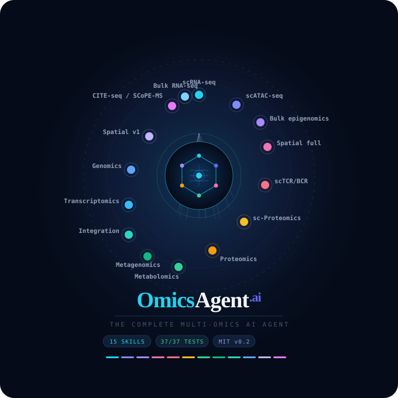

# 🧬 OmicsAgent.ai

<p align="center">
  
</p>

<p align="center">
  <strong>The complete multi-omics AI agent for bioinformatics</strong><br>
  Built on the Claude API · Local-first · Reproducible · MIT licensed
</p>

<p align="center">
  
  
  
  
</p>

---

## 15 Omics Skills

| # | Skill | Data Type | Key Tools |
|---|---|---|---|
| 1 | Genomics | WGS/WES/SNP | GATK, bcftools, plink |
| 2 | Transcriptomics | Bulk RNA-seq | DESeq2, salmon |
| 3 | scRNA-seq | Single-cell RNA | Scanpy, Seurat |
| 4 | Proteomics | Mass spec | MaxQuant, DIA-NN |
| 5 | Metabolomics | LC-MS/GC-MS | XCMS, MZmine |
| 6 | Bulk Epigenomics | ATAC + ChIP-seq | MACS3, deepTools |
| 7 | Spatial v1 | Visium | Squidpy, SpatialDE |
| 8 | Metagenomics | Shotgun/16S | MetaPhlAn, Kraken2 |
| 9 | sc-Proteomics | CITE-seq | Seurat WNN |
| 10 | Integration | Multi-omics | MOFA+, DIABLO |
| 11 | **scATAC-seq** | Single-cell ATAC | ArchR, ChromVAR |
| 12 | **Bulk Epigenomics Full** | 6 histone marks | deepTools, DiffBind |
| 13 | **Spatial Full** | Visium/MERFISH/CosMx/Stereo-seq | Squidpy, RCTD |
| 14 | **scTCR/BCR-seq** | Immune repertoire | Scirpy, IgBlast |
| 15 | **sc-Proteomics Full** | CITE-seq + SCoPE-MS | Seurat, limma |

---

## Quick Start
```bash
git clone https://github.com/madhubioinformatics/OmicsAgent
cd OmicsAgent
pip install -r requirements.txt
export ANTHROPIC_API_KEY="sk-ant-..."
python3 omics_agent.py --demo
```

## Usage
```bash
python3 omics_agent.py --demo          # run all 15 skills
python3 omics_agent.py --chat          # interactive chat mode
python3 omics_agent.py --skill scrna   # run one skill
python3 omics_agent.py --list          # list all skills
```

## Documentation

📖 **Website:** https://madhubioinformatics.github.io/OmicsAgent/

## Author

**Dr. Madhu Sudhana Saddala**
Bioinformatics Specialist, University of California, USA
🔗 https://www.researchgate.net/profile/Dr_Madhu_Sudhana_Saddala

## License

MIT — open source, free, reproducible.
